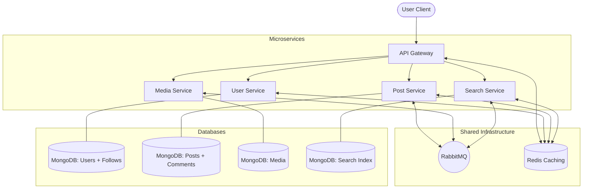

# 🌐 Social Media Microservice Platform

A scalable, event-driven social media backend and frontend built with a microservices architecture. It features service-to-service communication via **RabbitMQ**, high-speed caching with **Redis**, a unified entry point through an **API Gateway**, and a rich social feature set including **likes, comments, and follow/unfollow**.

---

## 🏗️ Architecture Overview

The system is divided into specialized microservices, each with its own database and responsibility. All external traffic flows through the **API Gateway**, which handles rate limiting, authentication, and request routing.



---

## ✨ Core Features

### 👤 User & Identity
- **Secure Auth**: Powered by Argon2 hashing and JWT tokens with refresh token rotation.
- **Identity Service**: Dedicated service for registration, login, and profile management.
- **Rate Limiting**: Redis-backed protection against brute-force and DDoS attacks.

### 👥 Follow / Unfollow System
- **Follow Users**: Follow/unfollow other users with duplicate prevention.
- **Follower & Following Lists**: Paginated lists of followers and following.
- **Follow Stats**: Get follower/following counts for any user.

### 📝 Post Management
- **CRUD Operations**: Complete post lifecycle management (Create, Read, Delete).
- **Event-Driven Sync**: Notifies other services (like Search) via RabbitMQ when posts are created or deleted.
- **Redis Caching**: Hot posts served from cache — 5 min TTL on list, 1 hour on single post.

### ❤️ Like / Comment System 
- **Like Toggle**: Like or unlike a post with a single endpoint — idempotent toggle pattern.
- **Comments**: Add, read (paginated), and delete your own comments on any post.
- **Live Counts**: `likesCount` persisted on the post document for O(1) count reads.

### 🖼️ Media Management
- **Cloud Integration**: Image uploads handled via **Cloudinary**.
- **On-the-fly Processing**: Uses Multer and specific service logic for secure file handling.
- **Async Indexing**: Media links are synced across services using message queues.

### 🔍 Search & Discovery
- **Live Search**: Dedicated search service for real-time indexing of platform content.
- **Dual Strategy**: MongoDB `$text` search for content + regex for username lookups.
- **Scalable Queries**: Optimized for high-throughput searching without impacting core services.

### 🩺 Health Check Endpoints 
- **All Services**: Every service exposes `GET /api/health` (or `/health` for the gateway).
- **Dependency Checks**: Each health check reports MongoDB, Redis, and/or RabbitMQ status.
- **K8s / Load-Balancer Ready**: Returns `200 OK` when healthy, `503 Service Unavailable` when degraded.

---

## 🛠️ Technology Stack

| Layer | Technologies |
| :--- | :--- |
| **Frontend** | React 19, Vite, Tailwind CSS 4, Axios, Framer Motion, Lucide React |
| **API Gateway** | Express, Redis (Rate Limit), Helmet, Express Http Proxy |
| **Microservices** | Node.js, Express, Mongoose, Joi (Validation), Winston (Logging) |
| **Databases** | MongoDB (Primary Store), Redis (Caching + Rate Limiting) |
| **Messaging** | RabbitMQ (amqplib) |
| **Security** | JWT, Argon2, Helmet |
| **Containerization**| Docker, Docker Compose |

---

## 📁 Project Structure

```text
micro-service/
├── backend/
│   ├── api-gateway/      # Entry point, Authentication & Rate Limiting
│   ├── user-service/     # Identity management, Follow/Unfollow system
│   ├── post-service/     # Post creation, Likes & Comments
│   ├── media-service/    # Cloudinary image uploads & management
│   ├── search-service/   # Content indexing & Search functionality
│   └── docker-compose.yml # Orchestration for all services
└── frontend/
    └── src/
        ├── api/          # Axios interceptors & Service calls
        ├── context/      # Auth & Post state management
        ├── pages/        # HomePage, LoginPage, SearchPage, etc.
        └── components/   # layout & post-specific UI components
```

---

## 🚀 Setup & Installation

### 🐳 Running with Docker (Recommended)

1. **Clone the repository**
   ```bash
   git clone <repo-url>
   cd micro-service
   ```

2. **Setup Global Environment**
   Configure the `.env` files in each service directory (see individual service directories for templates).

3. **Spin up Infrastructure**
   ```bash
   cd backend
   docker-compose up --build
   ```

### 🛠️ Manual Development Setup

1. **Start Infrastructure**: Ensure MongoDB, Redis, and RabbitMQ are running locally.
2. **Install & Run Services**:
   ```bash
   # Go into each service directory (gateway, user, post, etc.)
   npm install
   npm start
   ```
3. **Run Frontend**:
   ```bash
   cd frontend
   npm install
   npm run dev
   ```

---

## 📝 API Reference

### API Gateway Routes (`PORT: 3000`)

| Service | Route Prefix | Auth Required | Description |
| :--- | :--- | :--- | :--- |
| **Gateway** | `/health` | No | Gateway health check |
| **User Service** | `/v1/auth` | No | Register, Login, Logout, Refresh Token |
| **User Service** | `/v1/users` | Yes | Follow / Unfollow system |
| **Post Service** | `/v1/posts` | Yes | Posts, Likes & Comments |
| **Media Service** | `/v1/media` | Yes | Image uploads |
| **Search Service**| `/v1/search`| Yes | Content search |

---

### 🩺 Health Check Endpoints

| Service | Endpoint | Checks |
| :--- | :--- | :--- |
| API Gateway | `GET /health` | Redis |
| User Service | `GET /api/health` | MongoDB, Redis |
| Post Service | `GET /api/health` | MongoDB, Redis, RabbitMQ |
| Media Service | `GET /api/health` | MongoDB, RabbitMQ |
| Search Service | `GET /api/health` | MongoDB, Redis, RabbitMQ |

**Example Response:**
```json
{
  "status": "ok",
  "service": "post-service",
  "uptime": 3600.5,
  "timestamp": "2026-06-29T12:00:00.000Z",
  "dependencies": {
    "mongodb": "ok",
    "redis": "ok",
    "rabbitmq": "ok"
  }
}
```

---

### ❤️ Like / Comment Endpoints (via `/v1/posts`)

| Method | Endpoint | Description |
| :--- | :--- | :--- |
| `POST` | `/v1/posts/:id/like` | Toggle like/unlike on a post |
| `GET` | `/v1/posts/:id/likes` | Get likes count and list |
| `POST` | `/v1/posts/:id/comments` | Add a comment to a post |
| `GET` | `/v1/posts/:id/comments` | Get paginated comments |
| `DELETE` | `/v1/posts/:id/comments/:commentId` | Delete your own comment |

**Like Toggle Response:**
```json
{ "success": true, "liked": true, "likesCount": 42 }
```

**Add Comment Body:**
```json
{ "content": "Great post!" }
```

---

### 👥 Follow / Unfollow Endpoints (via `/v1/users`)

| Method | Endpoint | Description |
| :--- | :--- | :--- |
| `POST` | `/v1/users/:userId/follow` | Follow a user |
| `DELETE` | `/v1/users/:userId/unfollow` | Unfollow a user |
| `GET` | `/v1/users/:userId/followers` | Get paginated followers list |
| `GET` | `/v1/users/:userId/following` | Get paginated following list |
| `GET` | `/v1/users/:userId/follow-stats` | Get follower/following counts |

**Follow Stats Response:**
```json
{
  "success": true,
  "userId": "64abc...",
  "followersCount": 150,
  "followingCount": 72
}
```

---

