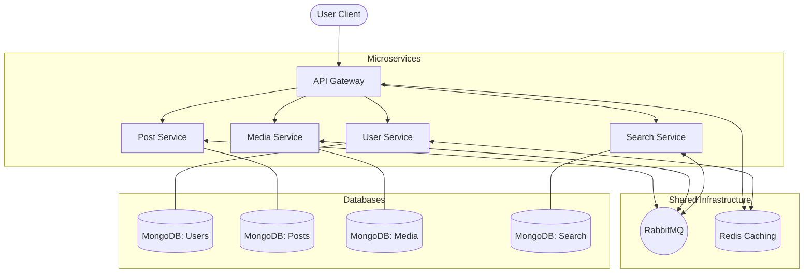

# 🌐 Social Media Microservice Platform

A scalable, event-driven social media backend and frontend built with a microservices architecture. It features service-to-service communication via **RabbitMQ**, high-speed caching with **Redis**, and a unified entry point through an **API Gateway**.

---

## 🏗️ Architecture Overview

The system is divided into specialized microservices, each with its own database and responsibility. All external traffic flows through the **API Gateway**, which handles rate limiting, authentication, and request routing.



---

## ✨ Core Features

### 👤 User & Identity
- **Secure Auth**: Powered by Argon2 hashing and JWT tokens.
- **Identity Service**: Dedicated service for registration, login, and profile management.
- **Rate Limiting**: Redis-backed protection against brute-force attacks at the Gateway level.

### 📝 Post Management
- **CRUD Operations**: Complete post lifecycle management (Create, Read, Update, Delete).
- **Event-Driven Sync**: Notifies other services (like Search) via RabbitMQ when posts are created or updated.

### 🖼️ Media Management
- **Cloud Integration**: Image uploads handled via **Cloudinary**.
- **On-the-fly Processing**: Uses Multer and specific service logic for secure file handling.
- **Async Indexing**: Media links are synced across services using message queues.

### 🔍 Search & Discovery
- **Live Search**: Dedicated search service for real-time indexing of platform content.
- **Scalable Queries**: Optimized for high-throughput searching without impacting core post/user services.

---

## 🛠️ Technology Stack

| Layer | Technologies |
| :--- | :--- |
| **Frontend** | React 19, Vite, Tailwind CSS 4, Axios, Framer Motion, Lucide React |
| **API Gateway** | Express, Redis (Rate Limit), Helmet, Express Http Proxy |
| **Microservices** | Node.js, Express, Mongoose, Joi (Validation), Winston (Logging) |
| **Databases** | MongoDB (Primary Store), Redis (Caching) |
| **Messaging** | RabbitMQ (amqplib) |
| **Security** | JWT, Argon2, Helmet |
| **Containerization**| Docker, Docker Compose |

---

## 📁 Project Structure

```text
micro-service/
├── backend/
│   ├── api-gateway/      # Entry point, Authentication & Rate Limiting
│   ├── user-service/     # Identity management & User profiles
│   ├── post-service/     # Post creation & lifecycle
│   ├── media-service/    # Cloudinary image uploads & management
│   ├── search-service/   # Content indexing & Search functionality
│   └── docker-compose.yml # Orchestration for all services
└── frontend/
    └── src/
        ├── api/          # Axios interceptors & Service calls
        ├── context/      # Auth & Post state management
        ├── pages/        # HomePage, LoginPage, SearchPage, etc.
        └── components/   # layout & post-specific UI components
```

---

## 🚀 Setup & Installation

### 🐳 Running with Docker (Recommended)

1. **Clone the repository**
   ```bash
   git clone <repo-url>
   cd micro-service
   ```

2. **Setup Global Environment**
   Configure the `.env` files in each service directory (see individual service directories for templates).

3. **Spin up Infrastructure**
   ```bash
   cd backend
   docker-compose up --build
   ```

### 🛠️ Manual Development Setup

1. **Start Infrastructure**: Ensure MongoDB, Redis, and RabbitMQ are running locally.
2. **Install & Run Services**:
   ```bash
   # Go into each service directory (gateway, user, post, etc.)
   npm install
   npm start
   ```
3. **Run Frontend**:
   ```bash
   cd frontend
   npm install
   npm run dev
   ```

---

## 📝 API Gateway Routes (`PORT: 3000`)

| Service | Route Prefix | Auth Required |
| :--- | :--- | :--- |
| **User Service** | `/v1/auth` | No |
| **Post Service** | `/v1/posts` | Yes |
| **Media Service** | `/v1/media` | Yes |
| **Search Service**| `/v1/search`| Yes |

---
*Happy coding! 🚀*
